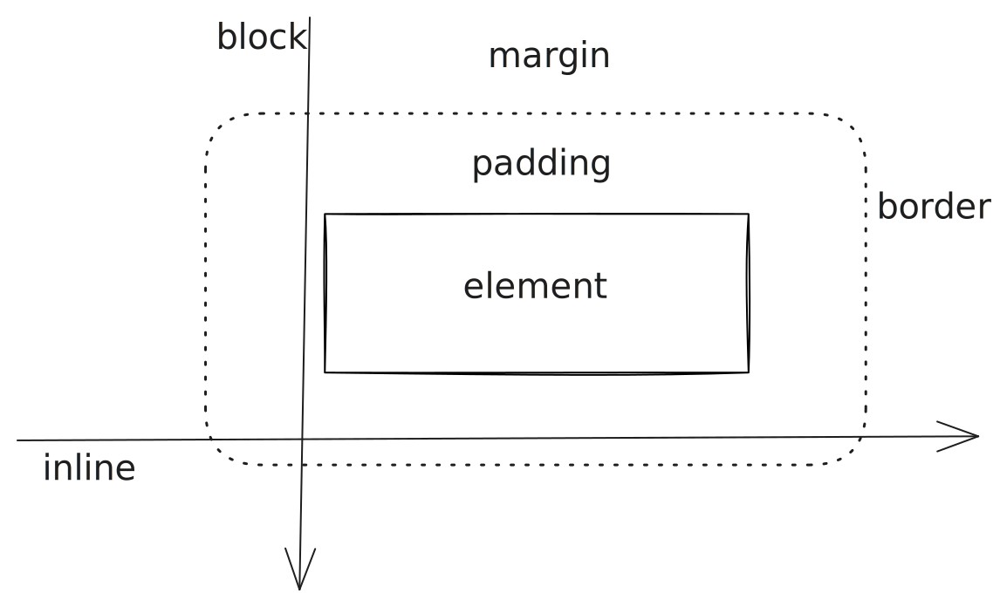

The five minutes may be an overstretch, but in this post we will write a small browser-based To-Do List application without much fanfare. This is an introductory post into website development.

---

## Preamble

In this blog post I try to explain the way I would write the tiniest possible To-Do List I can imagine.
I will try to cover basic HTML, CSS and JavaScript features as well as put emphasis on some more forgotten aspects of web development.
If you have no idea what any of this means, do not fear I will go through it thorougly.
Nevertheless this is not a complete guide or introduction to web development, but more a kind of appetizer for the broad field of web development.

_TL;DR: [Here is a codesandbox](https://codesandbox.io/s/todo-list-in-5-minutes-itmqx?file=/index.html)_

## Introduction

Web development is a broad term describing the process of developing websites, applications or more general software, which is utilizing browser technologies.
While browser technologies is a broad term in this post I will concentrate on HTML, CSS and JavaScript all as tiny as possible to be able to explain everything as detailed as necessary.
Additionally I want to try to cover bordering topics but we will see how this goes.

#### What is a website actually?

Everybody has an understanding of what a website is and if I would ask my grandma she would say "Its that thingy I can open with a browser."
And thats completly right, but to get a browser to properly display a website it might be interesting to understand what a website actually is.

**A website is a specially formatted file, which your browser can understand and visualize.**

This means a website can be a file on your computer, on the computer of a friend or on a sever (a big computer accesible by everyone on the internet).
The file is transfereed using a special protocl called Hypertext Transfer Protocol (**HTTP**), which goes further then this blog post would want to..
So the file has to be formatted in a special way.
And this format is called **HTML** (Hypertext Markup Language), and it was first designed to display raw text.
The internet was intented to simply share text documents within a small network of computers, which were mostly owned by research labs and as such most of the things they wanted to exchange were of textual content.

WIth the development of the web and further spread the desire to style and beautify your documents got larger and so some browser vendors started to implement styling options.
It was a hot mess and everyone did everything differently but over time a standard emegered, named **CSS** (Cascading Style Sheets).

We are now at the end of the 20th century and the web is booming, browser need to compete and a small company called [Netscape fights](<https://en.wikipedia.org/wiki/Browser_wars#First_Browser_War_(1995%E2%80%932001)>) against huge-ass and upright monopoly seeking Microsoft.
So they innovate to keep their product, the Netscape Navigator alive and [Brendan Eich](https://en.wikipedia.org/wiki/Brendan_Eich) (_a debatable figure_), designs and introduces JavaScript (**JS**) into the Netscape Navigator, to allow for interactive websites.
This great idea is propelled forward by Sun Microsystems the corporation behind the hugely popular Java language.
The similarity in name is no coincidence as JavaScript should profit from the popularity of Java, but they are quite different apart from the name.

## Writing a website

#### The basic structure of HTML

A HTML document is the basis of every website and follows a specific skeleton, which is always the same.
The document has some blocks, which allow the browser to easily read and understand your document.
Those special blocks are composed using `<` and `>`. One block is called a tag and there two (and a half kind of tags):  
"Normal" tags start with an opening angle bracket, followed by the tagname and then a closing angle bracket, e.g. `<html>`.
Then follows the inner content of the block.
Finally the block has to close using an opening angle bracket followed by a forward slash, the tagname and then again a closing angle bracket, e.g. `</html>`.
Those tags may also self close aka they will just start with an opening angle bracket, followed by the tagname a white space and then a forward slash and a closing angle bracket e.g. `<div />`.
Those elements simply have no content in them.
Then there are automatically self-closing tags. They are similar to "normal" self closing as they do not conatin any content, but you have to omit the forward slash.
One such example is the `` tag, which is used to embed images into the text.
An automatically closing tag does not need or in some places is unable to contain a forward slash.  
Getting that out of the way we can look to our first code snippet, which starts us of building a website.
If you want to follow along you may create a new file, (you can name it whatever you want, but I recommend `index.html` or atlest using `.html` as a file ending) and paste the following code using you favorite texteditor (On Windows you may use Notepad, on Mac TextEdit etc.).

```html
<!DOCTYPE html>
<html lang="en">
  <head>
    <!-- meta information -->
  </head>

  <body>
    <!-- content of your website -->
  </body>
</html>
```

At the beginning of our code we find a special tag `<!DOCTYPE html>`.
It tells the browser, that he should be ready ready to read and parse an HTML document.
Parsing is the step, where the brwoser transforms the file into a structure understandable to him.
Afterwards we find our first tag.
All other tags (except comments) have to be within that tag and that why it is called a root tag.
Programmers love trees and as such they often use them as metaphors.
Within our [`html`](https://developer.mozilla.org/en-US/docs/Web/HTML/Element/html) root tag we find an attribute and two child tags.
The attribute specifies the language of our webiste to English.
More on properties follows later.
One of the child tags is for [meta information (`head`)](https://developer.mozilla.org/en-US/docs/Web/HTML/Element/head) and one for the actual [content of our website (`body`)](https://developer.mozilla.org/en-US/docs/Web/HTML/Element/body).
They both contain [comments](https://developer.mozilla.org/en-US/docs/Web/HTML/Comments).
A comment is not displayed in our website and is only used to help a developer guide through the code.
HTML comments alwas start with an angle bracket and a bang.
They are then followed by two dashes and then the content before closing with two dashes and angle bracket, e.g. `<!-- This is a comment. -->`.
This is the skeleton for our website and when we look back to our tree metaphor, we may visualize it as such.


#### Adding meta information

To ensure our browser can happily and correctly parse our document we have to tell it some other things execpt our document is HTML.
One of those things is the charset.
A charset instructs a program to know how to parse a single char.
As a computer on the lowest level can only understand zero and one, one character is represented as a standardized sequnce of zero and ones.
One charset is such a standardized way to (encode mutliple charachters)[].
We tell the browser the used charset of our HTML document is "UTF-8" using an automatically self-closing `meta` tag.
As a self-closing tag cannot contain content HTML provides another set to allow us to add information to a tag.
This option are attributes and they are defined in the opening tag of a block.
An attribute is categorized by a name and often is followed by an equal sign and then the attributes value.
For our [`meta`](https://developer.mozilla.org/en-US/docs/Web/HTML/Element/meta) tag we define the attribute `charset` as `"UTF-8"`.
The hyphens are needed to tell the browser, that the attribute has to be understood as text and not anything else.

```diff-html
 <head>
-  <!-- meta information -->
+  <meta charset="UTF-8" />
+  <title>To-Do List</title>
 </head>
```

The second tag we define is the [`title`](https://developer.mozilla.org/en-US/docs/Web/HTML/Element/title) block, which is able to contain content.
Its textual content is taken as the title of our document like the name suggests.
The browser takes this property to label the tab, with which the website is opened.
If you want to view our progress, you may open the `.html` file, which you are editing, in your browser.

#### Adding visible content

If you did open your file in browser you wold have seen an empy white space staring back at you.
Let us change this by adding actual content to out site.
We can then use this content to implment a very basic styling of our elements.
We will add a lot of nodes, but do not be overwhelmed we will move through them step by step.
Fist we add an `h1` tag.
There are tags staring with `h` ranging from 1 to 6 and they signify a [heading](https://developer.mozilla.org/en-US/docs/Web/HTML/Element/Heading_Elements).
The lower the number the more top level the heading is.
This is oftern very helpfule to structure your textual content.
Some search engines might even analyse your webpage and use the headings to better structure your page.
In general a page should only have one `h1` (top-level) tag.

```diff-html
 <body>
-  <!-- content of your website -->
+  <h1> Todo List</h1>
+  <ul id="list">
     <!-- your list goes here -->
+  </ul>
 </body>
```

Afterwards we add a few nodes to actually display a list of items.
For lists HTML defines two seperate kind of nodes.
For [orderd lists `ol`](https://developer.mozilla.org/en-US/docs/Web/HTML/Element/ol) is used.
As our list does not necessiraly follow an inherent order we use the unorderd list element named [`ul`](https://developer.mozilla.org/en-US/docs/Web/HTML/Element/ul).
_(See what they did there? - **O**rderd **L**ist and **U**norderd **L**ist)_
Addiotnally we give the list an attribute of [`id`](https://developer.mozilla.org/en-US/docs/Web/HTML/Global_attributes/id).
An `id` should be unqie across your whole document and helps you in interacting with it from the other browser technologies.
The id is aptly named `list` as it identifies the element.
Nested with in the list are the elements of it.
The element is the same no matter if the list is orderd and its tag is a [`li`](https://developer.mozilla.org/en-US/docs/Web/HTML/Element/li).
In our case the list element contains three additional elements and has an attribute `class` with the value of `todo`.
The class attribute is used in this case to group the items logically and ensure we can later on add or remove all of them at once.
Two of them are input elements, while the last one is a button.
The [input elements](https://developer.mozilla.org/en-US/docs/Web/HTML/Element/input) are as the name indicates used to capture input from an user.
The input elements are further identifed by their types.
The type of `checkbox` renders a small box, which the user can click to select or deselect something.
You are probably familar with them if you ever had to accept the conditions somewhere.
The type of `text` is the default and simply renders a possible for a user to enter a line of text.
It is renderd as a single line element in comparison to a textarea, which contains multiple rows.
Finally there is the [`button`](https://developer.mozilla.org/en-US/docs/Web/HTML/Element/button).
It renders a clickable element to the user, which invokes an action.
The action though has to be added manually though (in most cases atlest).
Via an attribute we add the `class` of `delete` to the button, which allows us to style it later according to our needs.
Finally after the list we a button with the `id` of `add`, which will later allow us to add a new task to out list.
Right now we did not attach any action to it, so it does nothing.
If you refesh your site now you can hopefully see your work.
A proud pat on the shoulder as we now have completed the first step and displayed the first things from our webpage.

```diff-html
 <h1> Todo List</h1>
+<ul id="list">
+  <li class="todo">
+    <input type="checkbox" />
+    <input type="text" />
+    <button class="delete">Delete</button>
+  </li>
+</ul>
+<button id="add">Add Task</button>
```

As part of completing this inital content we added I will once again show the wonderful inverted tree.
There are a lot more nodes added and it is now becoming increasingly complex.

. Then may follow a seperator. The seperator signifies what type follows. A hash means the id follows, a dot is follwed by a class and a brackets includes any attribte follwed by its value after the eqaul sign")

## Styling

We want to apply minimal styling to our webpage to give a nice border around our list entries as well as showing, when a task is completed.
For that we only need minimal styles.
Styles for a web page are parsed from the **C**ascading **S**tyle **S**heets (CSS).
CSS is a declerative language which consists of a selector followed by rules to apply to this selector.
A selector describes which elements will be targeted.
A selector is very similar to the naming schema in the picture above.
There are type selectors like `h1`, which would select all elements with a tag of `h1`.
Elements with a certain class can be selected by prefixing the selector with a a dot, for example `.class`.
Selecting by id is done using a hash as in `#id`.
Additonally there are also complex attribute selectors, which are more complex and are specified in brackets.
Any combination of slectors is possible, but the white or non whitespace between selectors is important.
These so called combinators come in multiple shapes.
None whitespace means that all selectors apply to a single element.
A comma lists mutltiple selectors, which are not related to each other.
A single (or multiple) whitespace specifies a descendant of the first element.
So any element matching the second selector below the elements selected by the first selector.
If you would only like to select direct children a `>` is used.
Only elements on the level directly below the first element would be checked by the second selector.
If you would like to check sibling nodes, meaning those on the same level as the element in the first selector, a `~` is used.
In the case you only want the sibling right next to it, a `+` is used.

```css
/*| selector
  v */
.todo {
  list-style: none; /*<- value*/
} /*^
    | attribute*/
```

Any rules enclused in the curly brackets are defined using an attribute specifier and a value, sepreated by a colon and clsed by a semicolon.
The semicolon can be omitted if it is the last rule in the block, but as a good prectice it is nearly always kept.
The list of attributes is nearly endless and the values depend on the attribute so we will only look at the rules needed for our small application.
Those will be injected into our page using a style tag in the header.
The rules for our application consist of only two selectors.
One specifies a selection of our `li` elements tagged with a class of `todo` and it specifies two rules.
One removes the points before our list elements (`list-style: none`), while the other allows for a nice gap between the single list items (`padding-block: 0.25rem`).
The other rule uses a direct sibling combinator and a special `:checked` combinator.
This selector specifies that any checkbox, that is toggled on (checked) should style the following input element with a strike through the text in it.
This allows us to present an item as crossed off from our list.

```diff-html
 <head>
   ...
+  <style>
+    .todo {
+      list-style: none;
+      padding-block: 0.25rem;
+    }
+    input:checked + input {
+      text-decoration: line-through;
+    }
+  </style>
 </head>
```

The rule for our nice space around our item deserves a little bit more of an explanation.
Hopefully the picture below can guide us through the rule a bit clearer.
